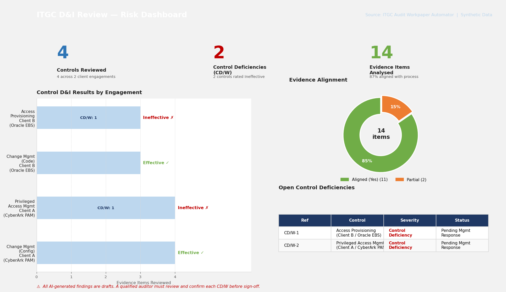

# ITGC Audit Workpaper Automator

A CLI tool that uses Claude AI to automate the documentation of IT General Controls (ITGC) design and implementation reviews, generating a formatted Excel workpaper.

## What it does

For each ITGC control you review, the tool will:

1. **Analyse evidence** — uploads screenshots, Excel files, Word docs, and PDFs to Claude, which describes each piece of evidence in professional audit workpaper language
2. **Perform gap analysis** — Claude compares the client's stated process against the evidence for each tailored procedure, flagging gaps
3. **Identify control deficiencies** — if evidence doesn't support the process, Claude creates a CD/W draft with a description and severity rating
4. **Generate the workpaper** — produces a formatted `.xlsx` file with one tab per control, covering:
   - Section A: Tailored Procedures (with responses and gap flags)
   - Section B: Process Description
   - Section C: Evidence Analysis (chronological, with descriptions and alignment)
   - Section D: Control Deficiencies (CD/W references)
   - Section E: Conclusion

## Professional Scepticism — Human Review Required

> **The AI drafts. The auditor decides.**

This tool is a drafting assistant, not a decision-maker. All AI-generated content — evidence descriptions, gap analysis, CD/W write-ups, and conclusions — is a **first draft for auditor review** and must not be included in a final workpaper without independent verification by a qualified auditor.

Before sign-off, the reviewing auditor must:

- **Verify evidence descriptions** against the actual source files to confirm accuracy
- **Exercise professional judgement** on each flagged gap — the AI identifies potential issues; the auditor determines whether a control deficiency exists and at what severity
- **Review and reword** any CD/W draft to reflect the precise facts and the auditor's own conclusions
- **Confirm conclusions** are supported by the totality of evidence, not solely the AI's summary

This requirement is consistent with professional standards (ISA 315, PCAOB AS 2201) and the expectation that auditors maintain responsibility for the quality and accuracy of their workpapers regardless of the tools used to prepare them.

## Dashboard

The three Power BI-ready sheets in every workpaper (`PBI_Controls`, `PBI_Deficiencies`, `PBI_Evidence`) can be connected to Power BI in one step (**Get Data → Excel**) to produce a real-time risk dashboard across all engagements:



*Built from the included synthetic sample data. All client references are anonymised.*

## Sample output

Two sample workpapers are included, both generated from fully synthetic data:

**[Sample 1 — Client B / Oracle EBS (.xlsx)](sample_output/Acme_Corp_Oracle_EBS_ITGC_Workpaper_FY2025_SAMPLE.xlsx)**
- Access Provisioning (New Starter) — 3 evidence items, 1 CD/W (missing SoD documentation)
- Change Management — Code Changes — 3 evidence items, no deficiencies

**[Sample 2 — Client A / CyberArk PAM (.xlsx)](sample_output/Client_A_CyberArk_PAM_ITGC_Workpaper_FY2025_SAMPLE.xlsx)**
- Privileged Access Management — 4 evidence items (EPV Safe membership, access request workflow, PSM session log, CPM rotation dashboard), 1 CD/W (dormant contractor accounts not identified in quarterly Safe membership recertification)
- Change Management — Configuration Changes — 4 evidence items (ServiceNow CR, CAB minutes, post-implementation review, emergency change), no deficiencies

Each workpaper includes all five sections per control tab plus three Power BI flat-table sheets (`PBI_Controls`, `PBI_Deficiencies`, `PBI_Evidence`).

## Supported ITGC Controls

| # | Control |
|---|---------|
| 1 | Access Provisioning (New Starter) |
| 2 | Access Deprovisioning (Leaver) |
| 3 | Privileged Access Management |
| 4 | Authentication Controls |
| 5 | Database Access Controls |
| 6 | User Access Recertification (UAR) |
| 7 | Change Management — Code Changes |
| 8 | Change Management — Configuration Changes |

## Supported Evidence Formats

- **Images**: PNG, JPG, JPEG, GIF, BMP, WebP (analysed via Claude's vision)
- **Spreadsheets**: XLSX, XLS, CSV
- **Documents**: DOCX, DOC
- **PDF**: PDF
- **Plain text**: TXT and other text files

## Power BI Integration

Every generated workpaper includes three flat-table sheets formatted as native Excel Tables. Point Power BI's **Get Data → Excel** at the file and these sheets appear immediately as importable tables — no transformations needed.

| Sheet | Grain | Use Case |
|-------|-------|----------|
| `PBI_Controls` | One row per control | Risk heatmap by application / D&I result |
| `PBI_Deficiencies` | One row per CD/W | Deficiency tracker, severity breakdown |
| `PBI_Evidence` | One row per evidence item | Evidence coverage view, alignment rate |

Join the three tables on `Control_Name` to build a full dashboard. The `D_I_Result` column (`Effective` / `Ineffective`) is pre-calculated for KPI cards.

## Setup

```bash
# Install dependencies
pip install -r requirements.txt

# Set your API key
cp .env.example .env
# Edit .env and add your ANTHROPIC_API_KEY
```

## Usage

```bash
python main.py
```

The tool runs as an interactive CLI wizard:

1. Enter client name, application, and audit period
2. Select which ITGC controls to document
3. For each control, paste the client's end-to-end process description
4. Add evidence file paths one by one (with optional description hints)
5. The tool analyses everything with Claude and generates the workpaper
6. **Review all AI-generated content before finalising the workpaper**

### Example session

```
====================================================
  ITGC Audit Workpaper Automator  |  Powered by Claude
====================================================

  Client name: [Client name]
  Application name (e.g. Oracle EBS, SAP): Oracle EBS
  Audit period (e.g. FY2025, Q1 2025): FY2025

  Available ITGC Controls:
     1.  Access Provisioning (New Starter)
     2.  Access Deprovisioning (Leaver)
    ...

  Select controls (comma-separated numbers): 1,2

  ────────────────────────────────────────────────────
  Control 1 of 2: Access Provisioning (New Starter)
  ────────────────────────────────────────────────────

  Paste the end-to-end process description:
  (Press Enter twice on a blank line to finish)

  > New starter requests are submitted via ServiceNow by the line manager...
  > Access is provisioned by IT within 2 business days of approval...
  >
  >

  Evidence files for 'Access Provisioning (New Starter)'
  File 1 path: /path/to/servicenow_request.png
  Brief description: ServiceNow access request ticket
  File 2 path: done

  Analysing: Access Provisioning (New Starter)
  Evidence analysis:
    ✓ servicenow_request.png
  Gap analysis ... complete  (1 deficiency identified)

====================================================
  ✓ Workpaper saved to: Client_Oracle_EBS_ITGC_Workpaper_FY2025.xlsx

  Controls documented:      2
  Evidence files analysed:  3
  Control deficiencies:     1
====================================================

  ⚠  Review all AI-generated content before finalising.
====================================================
```

### Options

```
python main.py --output my_workpaper.xlsx   # Custom output filename
python main.py --api-key sk-ant-...         # Pass API key directly
```

### Generate samples without an API key

```bash
python generate_sample.py
# → sample_output/Acme_Corp_Oracle_EBS_ITGC_Workpaper_FY2025_SAMPLE.xlsx
# → sample_output/Client_A_CyberArk_PAM_ITGC_Workpaper_FY2025_SAMPLE.xlsx
```

## Privacy & Security

> **This tool transmits evidence files (screenshots, documents, spreadsheets) to the Anthropic API for analysis.**
>
> Before use in a professional engagement context:
>
> 1. **Confirm your firm's AI data policy.** Most large firms have an approved AI gateway or internal LLM instance. Check whether you should substitute the `ANTHROPIC_API_KEY` for your firm's internal API credentials.
> 2. **Redact PII and client-sensitive data** (employee names, IP addresses, account numbers) from evidence files before processing, unless your firm's policy explicitly permits transmission of that data to the selected API endpoint.
> 3. **Never commit real client data to version control.** The `.gitignore` in this repository excludes all generated workpaper files (`*_ITGC_Workpaper_*.xlsx`) and the `.env` file containing your API key.
>
> All sample data in this repository is fully synthetic. No real client names, systems, or engagement details are present anywhere in this codebase.
